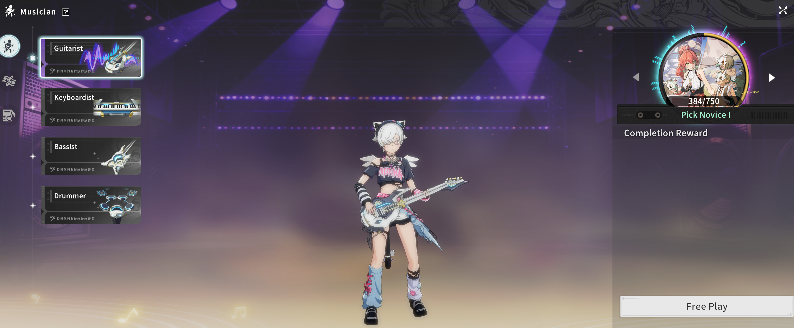

# BPSR Midi Player - optimised by Carmen




A plug-and-play desktop application designed to read standard MIDI (`.mid`) files and automatically transcribe them into precise keyboard strokes for Blue Protocol Star Resonance (BPSR) instrument playback.

> This project is a continuation of [saptia14/bpsr_midi_player](https://github.com/saptia14/bpsr_midi_player), which is no longer maintained. All credit for the original player, input simulation, and multiplayer sync goes to the original author. This fork adds the conversion pipeline, global hotkeys, test suite, and ongoing maintenance.

## Features

- **High-Accuracy Timing:** Uses Python's internal performance counters to guarantee millisecond-perfect playback without desyncing.
- **Hardware-Level Simulation:** Bypasses game input-blocking by injecting inputs directly at the OS level using Windows API (`ctypes.windll.user32.SendInput`).
- **Smart Octave Shifting:** Automatically maps notes to the optimal octave shift (`L Shift` or `L Ctrl`) and minimizes unnecessary toggle presses to ensure smooth chord playback.
- **Sustain Support:** Fully supports MIDI Sustain Pedal events (CC64), toggling the in-game `[Space]` bar.
- **Modern GUI:** Built with `customtkinter` for a beautiful dark-mode interface.
- **Channel Selector:** Mute or solo specific tracks inside a MIDI file (e.g., mute the drum track).
- **Global Hotkeys:** `F9` = play / resume, `F10` = pause, `F11` = stop — they work even while the game window is focused, so no more alt-tab dance.
- **Autoplay toggle:** When on, playback advances to the next loaded MIDI when a track finishes; when off (the default), it stops and releases all keys at the end of each track. Found next to the play controls in the Solo tab.
- **Peer-to-peer clock sync:** In multiplayer, each client measures its clock offset directly against the host over the network (NTP-style ping/pong), instead of relying on an external time server that firewalls often block. The lobby shows a live "Synced ±X ms" accuracy readout, and **Ready** stays locked until the clock is aligned — so players start together, not seconds apart. A per-player **Sync nudge (ms)** knob lets you dial out the last few milliseconds of residual offset (from network path asymmetry or input latency) by ear — set it once for your connection.

## Conversion Settings (v0.4)

The Solo tab includes a conversion panel that re-transcribes the loaded MIDI on the fly. Toggle options and hit **↻ Re-convert** (checkboxes apply instantly):

- **BPM (override):** Play the song at a different tempo than the file's original (shown next to the panel title, along with the time signature).
- **Speed:** Simple playback speed multiplier (e.g. `0.5` = half speed, `2.0` = double).
- **Max chord notes (1–5):** Caps how many notes strike simultaneously. Extra notes are dropped, loudest-first.
- **Note thinning:** Merges machine-gun same-pitch re-triggers and drops inaudible micro-notes — these usually just become dropped keystrokes in-game.
- **Cull low priority:** Inside dense chords, drops members much quieter than the loudest note.
- **Prioritize melody:** When trimming chords, the highest voice always survives.
- **Proportional remap:** Instead of octave-folding out-of-range notes, linearly compresses the song's whole pitch span into the allowed range — preserves melodic contour for songs written far outside the playable window.
- **Consistent windows:** Chord grouping uses a fixed time grid instead of greedy grouping, so re-converting with different options always slices chords the same way.
- **Voice-aware placement:** Out-of-range notes fold toward their own track's register instead of the nearest octave, keeping bass lines low and leads high.
- **Phrase gap shifting:** Picks one octave zone (Shift / none / Ctrl) per musical phrase and only toggles modifiers in the silence between phrases — no more missed notes from mid-run octave toggles.
- **Melody priority (octaves):** The game keyboard is a single 3-octave window that L-Shift / L-Ctrl slide up or down — so when the melody and a lower part are more than 3 octaves apart, they can't both sound and the app used to flip the shift back and forth, cutting the melody. This locks the octave shift to follow the melody (the top voice) so it's never interrupted, and silences the conflicting lower notes only in the spots where they physically can't coexist. (Takes precedence over Phrase gap shifting when both are on.)
- **Duet mode:** Splits the song at the **Duet split** note into a Low part (channel 0) and High part (channel 1). Use the channel checkboxes to play one half, or assign each half to a different player in the Multiplayer Lobby.
- **Auto-split parts:** Re-categorizes the loaded MIDI into channels by musical role instead of whatever channels the file happened to use — channel 0 = melody (the top voice), channel 1 = accompaniment, and with the 3-part option, channel 2 = bass (the lowest line). Uses a skyline split (highest/lowest sounding pitch at each moment), so a sustained melody keeps its role. Great for handing each part to a different player in multiplayer. The **Solo Active Channels** list shows each channel's note range and role name.
- **Range:** Allowed output range (note names like `C2`–`B7`, or raw MIDI numbers). Notes outside are octave-shifted to fit.
- **Shift delay / hold (ms):** Timing for the octave modifier keys — delay after toggling before the next note fires, and minimum hold before re-toggling. Raise the delay if high/low notes play at the wrong octave in-game.

## Setup & Installation

You have two options to run this application:

### Option 1: Plug-and-Play Executable (Recommended)
1. Go to the **Releases** page on GitHub.
2. Download the `BPSR_MIDI_Player.exe` file.
3. Run the executable. No Python installation required!

### Option 2: Run from Source
1. Clone this repository.
2. Install Python 3.8+
3. Install the dependencies:
   ```bash
   pip install -r requirements.txt
   ```
   *(Dependencies: `mido`, `customtkinter`)*
4. Run the app:
   ```bash
   python main.py
   ```

## Building the Executable

To produce the standalone `BPSR_MIDI_Player.exe` yourself, run `build_exe.bat` (or the equivalent PyInstaller command inside it). The result lands in `dist\`.

Releases are also built automatically: pushing a version tag (e.g. `v1.0.0`) triggers the GitHub Actions workflow in `.github/workflows/release.yml`, which runs the test suite, builds the .exe on a clean Windows machine, and attaches it to the GitHub release.

> Note: like most PyInstaller apps that send keystrokes, the .exe can occasionally trigger antivirus false positives. Building from source (or pointing users to the workflow logs showing the build provenance) is the usual answer.

## How to Use

1. Launch the application.
2. Click **Load MIDI** and select your `.mid` file.
3. Uncheck any channels/tracks you don't want to play.
4. **Important:** Switch to Blue Protocol, pull out your instrument, and ensure the game is in active focus!
5. Alt-tab to the player, click **Play**, and quickly click back into the game window.

> **Warning:** Because the app sends raw hardware keystrokes, it will type exactly where your cursor is focused. Do not leave a chat box open while playing!

## Keybindings Map

The app assumes the default BPSR keybindings:
- **Base Range:** C3 to B5
- **White Keys:** Z X C V B N M (C3-B3), A S D F G H J (C4-B4), Q W E R T Y U (C5-B5)
- **Black Keys:** 1 2 3 4 5, 6 7 8 9 0, I O P [ ]
- **High Octave:** L Shift
- **Low Octave:** L Ctrl
- **Sustain:** Space

*To change bindings, edit `config.py` and run from source.*
