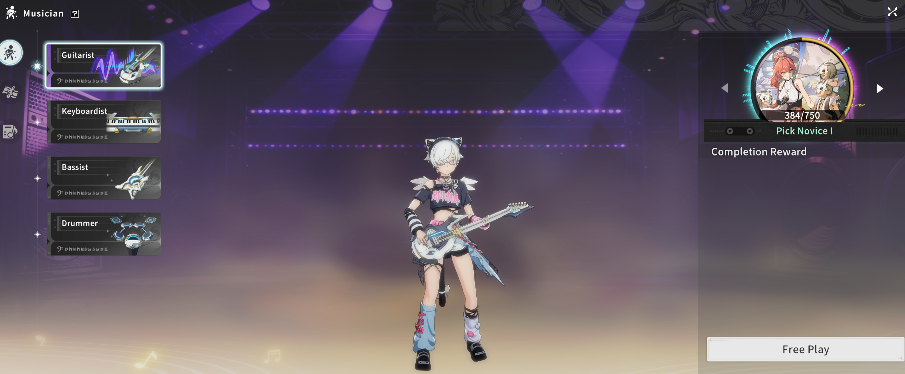
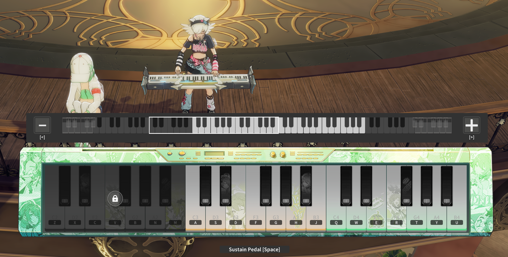

# BPSR Midi Player - optimised by Carmen




A plug-and-play desktop application designed to read standard MIDI (`.mid`) files and automatically transcribe them into precise keyboard strokes for Blue Protocol Star Resonance (BPSR) instrument playback.

> This project is a continuation of [saptia14/bpsr_midi_player](https://github.com/saptia14/bpsr_midi_player), which is no longer maintained. All credit for the original player, input simulation, and multiplayer sync goes to the original author. This fork adds the conversion pipeline, global hotkeys, test suite, and ongoing maintenance.

## Features

- **High-Accuracy Timing:** Uses Python's internal performance counters to guarantee millisecond-perfect playback without desyncing.
- **Hardware-Level Simulation:** Bypasses game input-blocking by injecting inputs directly at the OS level using Windows API (`ctypes.windll.user32.SendInput`).
- **Smart Octave Shifting:** Automatically maps notes to the optimal octave shift (`L Shift` or `L Ctrl`) and minimizes unnecessary toggle presses to ensure smooth chord playback.
- **Sustain Support:** Fully supports MIDI Sustain Pedal events (CC64), toggling the in-game `[Space]` bar.
- **Modern GUI:** Built with `customtkinter` for a beautiful dark-mode interface.
- **Source-aware Part Selector:** Group and select the MIDI by musical role,
  original track, 1-based MIDI channel, or detected General MIDI instrument
  family. Track names, programs, banks and percussion evidence are preserved.
- **Global Hotkeys:** `F9` = play / resume, `F10` = pause, `F11` = stop — they work even while the game window is focused, so no more alt-tab dance. Held keys do not auto-repeat; if a game or overlay already registered any of them, the app automatically switches to rising-edge Windows key polling.
- **Prepared autoplay:** When on, the next loaded MIDI is parsed and converted in the background, then starts without repeating the manual start delay. When off (the default), playback stops and releases all keys at the end of each track.
- **Optional per-MIDI settings:** Enable **Remember settings for each MIDI** to keep a separate conversion profile and Solo part selection for every item in the currently loaded playlist. Switching tracks restores its own instrument/arrangement instead of inheriting the previous song's settings. The option itself is remembered, while the profiles stay with the current app session.
- **Leave / Disband room:** Clients can **Leave Room** at any time (they drop off the host's roster and can join another room); the host can **Disband Lobby** to close the room, which returns every connected player to the disconnected state.
- **Peer-to-peer clock sync:** In multiplayer, each client measures its clock offset directly against the host over the network (NTP-style ping/pong), instead of relying on an external time server that firewalls often block. The lobby shows a live "Synced ±X ms" accuracy readout, and **Ready** stays locked until the clock is aligned — so players start together, not seconds apart. A per-player **Sync nudge (ms)** knob lets you dial out the last few milliseconds of residual offset (from network path asymmetry or input latency) by ear — set it once for your connection.
- **Authenticated private rooms:** Leaving the room field blank generates a high-entropy `bpsr3` invitation that pins the host's Ed25519 public key. Every participant has a separate signing identity, host-only commands cannot be forged by another room member, and replayed packets are rejected. Multiplayer Ready status is bound to the exact shared MIDI/conversion revision, so older `bpsr2` clients cannot silently join an incompatible room.
- **Encrypted multiplayer:** MQTT uses certificate-validated TLS on port 8883. Shared MIDI files carry a SHA-256 checksum and require confirmation before replacing a client's playlist. Enabling Autoplay explicitly allows authenticated host tracks to be accepted for that hands-off performance flow.
- **Host-led multiplayer autoplay:** Only the host advances the playlist. Each opted-in client receives and converts the authenticated next track, advertises its actual available parts, and automatically becomes Ready only if its existing assignment is still valid. The host sends the synchronized start after everyone is Ready; changed/missing parts safely pause the handoff for reassignment instead of playing the wrong channel.
- **Host-consistent multiplayer conversion:** The host's validated instrument and arrangement profile travels with the shared MIDI and is reused by every client. Later host setting changes are applied before clients can mark themselves Ready again; local focus, hotkey, and modifier-timing preferences stay local.
- **Optional client conversion override:** Clients can enable **Use my conversion settings (advanced)** in the lobby when they intentionally want their own instrument or arrangement. It is off by default and resets when leaving the room. The client securely advertises its converted part list for the current song, so the host assigns that player's actual local channels instead of incorrectly reusing the host's channel numbers.
- **Focus safety:** Key-down events are blocked unless a window whose title contains `Blue Protocol` is focused. Playback waits without consuming or skipping notes until the game receives focus. The target text and global F9–F11 hotkeys can be changed or disabled in the Solo tab.

## Conversion Settings (v0.4)

The Solo tab includes a conversion panel that re-transcribes the loaded MIDI on the fly. Toggle options and hit **↻ Re-convert** (checkboxes apply instantly):

- **Instrument:** Choose the in-game instrument before (or after) loading a MIDI. **Piano** (default) uses the full keyboard range (C2–B6) and behaves exactly as before. **Guitar** fits everything into E2–B4. **Bass** fits into E1–B2 — the in-game bass keyboard is the piano layout transposed down three octaves, so the app applies a matching key offset and the notes come out at the right pitch. Selecting an instrument sets the **Range** to its playable window, and all notes are transcribed/octave-folded to fit; you can still fine-tune the Range afterward. Each instrument is one line in `config.py`'s `INSTRUMENTS` table (`low`/`high` sounding range + `offset` if its keyboard is transposed from the piano's).

- **BPM (override):** Play the song at a different tempo than the file's original (shown next to the panel title, along with the time signature).
- **Speed:** Simple playback speed multiplier (e.g. `0.5` = half speed, `2.0` = double).
- **Max chord notes (1–5):** Caps how many notes strike simultaneously. Extra notes are dropped, loudest-first.
- **Note thinning:** Merges machine-gun same-pitch re-triggers and drops inaudible micro-notes — these usually just become dropped keystrokes in-game.
- **Cull low priority:** Inside dense chords, drops members much quieter than the loudest note.
- **Prioritize melody:** When trimming chords, the highest voice always survives.
- **Proportional remap:** Instead of octave-folding out-of-range notes, linearly compresses the song's whole pitch span into the allowed range — preserves melodic contour for songs written far outside the playable window.
- **Consistent windows:** Chord grouping uses a fixed time grid instead of greedy grouping, so re-converting with different options always slices chords the same way.
- **Voice-aware placement:** Out-of-range notes fold toward their own track's register instead of the nearest octave, keeping bass lines low and leads high.
- **Phrase gap shifting:** Picks one octave zone (Shift / none / Ctrl) per musical phrase and only toggles modifiers in the silence between phrases — no more missed notes from mid-run octave toggles.
- **Melody priority (octaves):** The game keyboard is a single 3-octave window that L-Shift / L-Ctrl slide up or down — so when the melody and a lower part are more than 3 octaves apart, they can't both sound and the app used to flip the shift back and forth, cutting the melody. This locks the octave shift to follow the melody (the top voice) so it's never interrupted, and silences the conflicting lower notes only in the spots where they physically can't coexist. It and Phrase gap shifting are mutually exclusive because both control the same modifier.
- **Duet mode:** Splits the song at the **Duet split** note into a Low part (channel 0) and High part (channel 1). Use the channel checkboxes to play one half, or assign each half to a different player in the Multiplayer Lobby.
- **Disable sustain pedal:** Strips every sustain (CC64) event from the piece, so the app never taps the in-game `[Space]`. Hold the sustain pedal manually in-game instead — this smooths out very fast passages where the rapid key re-triggering otherwise sounds glitchy and unnatural.
- **Group parts:** Choose **Musical roles**, **Original tracks**, **MIDI
  channels**, or **Instrument families**. Musical roles uses the authored pitch
  before range folding, so a bass or melody does not change identity when its
  octave is remapped. GM channel 10 percussion is excluded from melody/bass
  analysis and shown as a separate, initially unchecked part on pitch
  instruments. Instrument-family names are conservative hints based on program,
  bank and track metadata; the UI reports confidence instead of claiming an
  uncertain source is definitely a piano. MIDI channel labels are shown in the
  familiar 1–16 form. This is useful both for solo filtering and assigning
  performers in multiplayer.
- **Range:** Allowed output range (note names like `C2`–`B7`, or raw MIDI numbers). Notes outside are octave-shifted to fit.
- **Shift delay / hold (ms):** Timing for the octave modifier keys — delay after toggling before the next note fires, and minimum hold before re-toggling. Raise the delay if high/low notes play at the wrong octave in-game.
- **Retrigger gap (ms):** How long a key is held *up* before the same note sounds again. Most MIDI is quantized edge-to-edge, so a repeated note's release lands on the exact timestamp of the next note's press — and because the game samples the keyboard once per frame, it never sees the key come up and plays `C4 C4 C4 C4` as one long `C4`. The gap pulls each release back far enough for the repeat to register; only the release moves, never the onset. Raise it if repeated notes still slur together, lower it if fast repeated passages sound too clipped. Applies to every instrument, Drum included.

### Drum conversion

Selecting **Drum** reveals percussion controls instead of pitch-range and chord settings:

- **Drum source:** **Auto** safely preserves an authored GM channel-10 drum track and generates a groove when none exists. **Preserve** forces source-only mapping, **Augment** keeps it while filling missing kit roles, and **Generate** replaces it.
- **Style / Intensity:** Auto, Rock, Pop, Ballad, or Dance. Intensity changes the number and placement of hits rather than merely changing their volume.
- **Fills / Hats / Bass follow:** Set the fallback fill interval, quarter/eighth/sixteenth hat backbone, and how strongly off-beat notes in the inferred **low voice** influence the kick. High melody notes are analysed separately and can receive restrained ghost-snare answers.
- **Swing / Quantize:** Swing generated subdivisions; optionally pull preserved GM hits toward the grid without discarding their original timing by default.
- **Minimum spacing:** A same-drum retrigger limit in milliseconds. `0` uses the safe automatic value derived from the app's retrigger gap.

The arranger follows the MIDI's complete tempo and time-signature maps, keeps pickups on the correct bar grid, supports meters such as 3/4 and 6/8, treats a chord as one rhythmic onset, and uses sustained-note occupancy so held passages do not become accidental silence. Generated grooves also react to source dynamics, register, phrase gaps, section-energy changes, bass syncopation, and melody syncopation. Repeated bars receive deterministic motif variations, so re-converting the same MIDI stays repeatable without sounding like one pasted loop.

## Setup & Installation

You have two options to run this application:

### Option 1: Plug-and-Play Executable (Recommended)
1. Go to the **Releases** page on GitHub.
2. Download the `BPSR_MIDI_Player.exe` file.
3. Run the executable. No Python installation required!

### Option 2: Run from Source
1. Clone this repository.
2. Install Python 3.11+
3. Install the dependencies:
   ```bash
   pip install -r requirements.txt
   ```
   *(Dependencies include `mido`, `customtkinter`, `paho-mqtt`, and
   `cryptography`; `python-rtmidi` enables optional live-keyboard input.)*
4. Run the app:
   ```bash
   python main.py
   ```

## Building the Executable

To produce the standalone `BPSR_MIDI_Player.exe` yourself, run `build_exe.bat` (or the equivalent PyInstaller command inside it). The result lands in `dist\`.

Releases are also built automatically: pushing a version tag (e.g. `v1.0.0`) triggers the GitHub Actions workflow in `.github/workflows/release.yml`, which runs the test suite, builds the .exe on a clean Windows machine, and attaches it to the GitHub release.

> Note: like most PyInstaller apps that send keystrokes, the .exe can occasionally trigger antivirus false positives. Building from source (or pointing users to the workflow logs showing the build provenance) is the usual answer.

## How to Use

1. Launch the application.
2. Click **Load MIDI** and select your `.mid` file.
3. Uncheck any channels/tracks you don't want to play.
4. **Important:** Switch to Blue Protocol, pull out your instrument, and ensure the game is in active focus!
5. Alt-tab to the player, click **Play**, and quickly click back into the game window.

> **Safety:** Focus safety is enabled by default, so note presses and sustain toggles are sent only while a window matching the configured game title is focused. Keep it enabled unless you intentionally need another target, and avoid focusing an in-game chat box while playing.

## Keybindings Map

The app assumes the default BPSR keybindings:
- **Base Range:** C3 to B5
- **White Keys:** Z X C V B N M (C3-B3), A S D F G H J (C4-B4), Q W E R T Y U (C5-B5)
- **Black Keys:** 1 2 3 4 5, 6 7 8 9 0, I O P [ ]
- **High Octave:** L Shift
- **Low Octave:** L Ctrl
- **Sustain:** Space

*To change bindings, edit `config.py` and run from source.*
